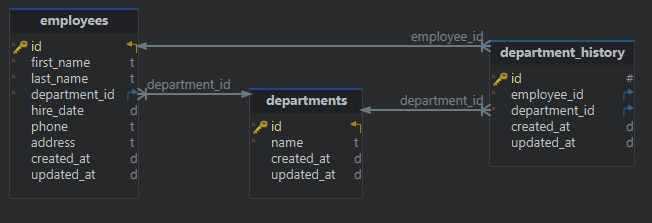

# Dunder Mifflin Management API

This project is a RESTful API that manages employees data and department history. It is designed to be modular and scalable, making it easy to maintain.

It is built with Express and includes the following features:

**SQLite Database:** A lightweight, portable database for simplicity in setup and usage. Perfect to work by doing a simple package restore and nothing more, as you requested.

**Sequelize ORM:** Abstracts database operations, simplifying model creation, migrations and data manipulation.

**Error Handling Middleware:** Centralized error management with custom error messages to be reused across the application.

**Modularized Route Structure:** Routes are organized separately for easier readability.

**Transaction Management:** Critical operations, such as creating or updating records across multiple tables, are wrapped in transactions to ensure data integrity.


## Run Locally

Clone the project

```bash
  git clone https://git.number8.com/pedro.pereira/fullstack-assessment-be.git
```

Go to the project directory

```bash
  cd fullstack-assessment-be
```

Install dependencies

```bash
  npm install
```

Run the migrations

```bash
  npm run migrate
```

Generate mock data (optional but highly recommended!)

```bash
  npm run seed
```

Start the server

```bash
  npm start
```


## Design Patterns

#### Singleton Pattern:

- It ensures a single instance of the database connection, optimizing resource use and maintaining consistency.

#### Repository Pattern:

- Implemented to abstract the database logic, providing consistent interfaces for accessing the data, handling errors, and supporting transactions.

#### Facade Pattern:

- Applied on controllers to abstract away the internal complexity delegated to services.


## Database Diagram

